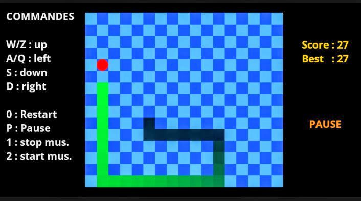

# Examples

Reading through API references only goes so far; seeing a complete, working game built with **RE:MAKE 2D** is often what makes everything click.

---

## Overview

This page presents different sample games built to help you get familiar with the **API** and **usage** of **RE:MAKE 2D**'s modules. 
Each of these test games comes with its own CMake build file to make compiling them straightforward.

---

## Games

### Snake

Snake is a popular retro game where the goal is to eat as many apples as possible without dying.
This example mainly covers the `Window`, `TileGrid`, `Actor`, and `Sound` modules, among others.
Click the button below to download the ZIP file:

[download](zip/snake.zip){ .md-button }