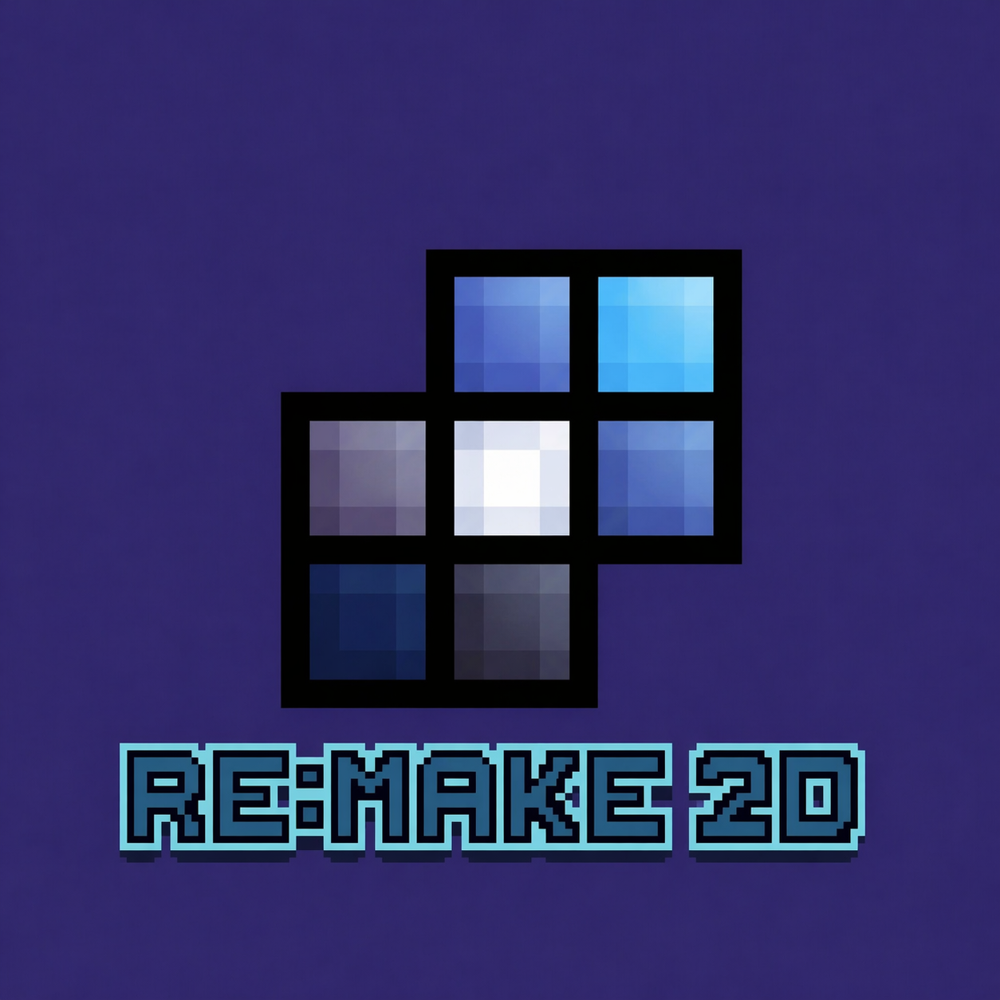

# RE:MAKE 2D



**A simple, expressive, and complete C++20 2D engine.**

---

<div class="grid cards" markdown>

- :material-code-braces:  Intuitive API
    
    ---
    
    An object-oriented API designed to be readable and pleasant to use,
    combinaison of **peformance** and **simplicity** .
  
- :material-script-text:  Lua Scripting

    ---
    
    Native Lua integration via **sol2** with hot-reload,
    allowing you to modify your game's behavior without recompiling.

- :material-vector-square:  Built-in Physics

    ---
    
    Powered by **Box2D v3**  — static bodies, dynamic bodies,
    collisions, and ready-to-use physics signals.

- :material-content-save:  JSON Save System

    ---
    
    Simple save system with `rmk::DataFile` .
    implement `sdata()` and `ldata()` for save **your owns types**.

</div>

---

## Quick Start

```cpp
#include <remake2d/all/graphics.hpp>

int main(void) {
    rmk::Window win("My Game");
    rmk::Circle circle(win.center(), 100);

    rmk::loop.execute(win, [&]() {
        win.draw(circle, rmk::color::cyan);
    });
    rmk::loop.update();
}
```

[GitHub :octicons-mark-github-24:](https://github.com/agemo-dev){ .md-button }
[Get started :octicons-arrow-right-24:](home/about.md){ .md-button .md-button--primary }

---

!!! info
    **RE:MAKE 2D** is currently at **1.0 version** .
    The engine is functional but may contain bugs.
    Feel free to report an issue.