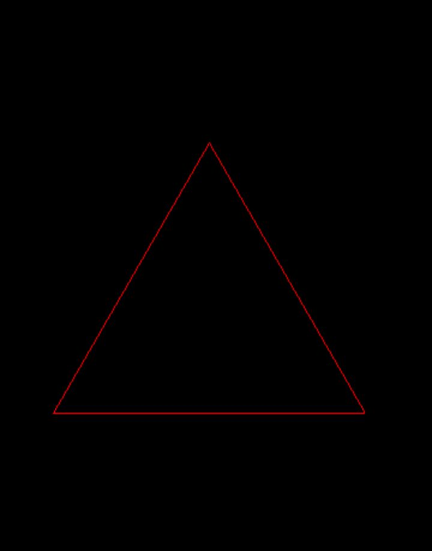
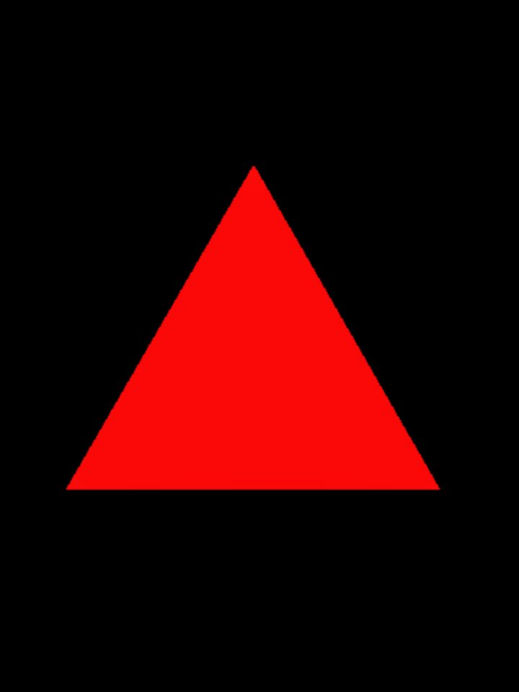
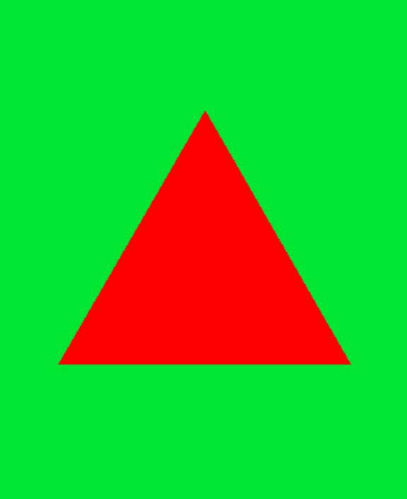
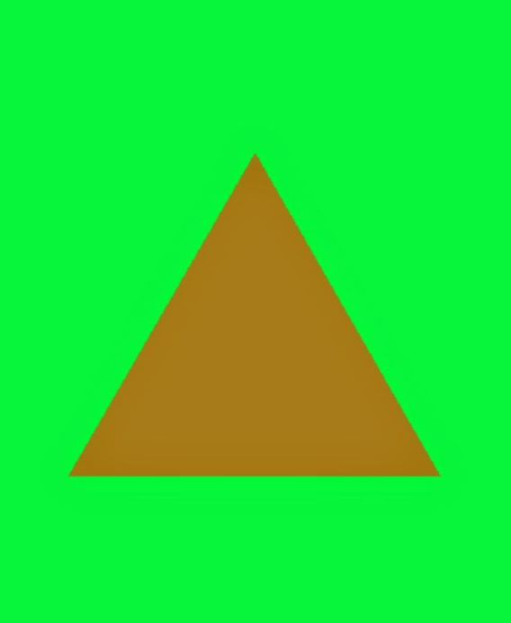
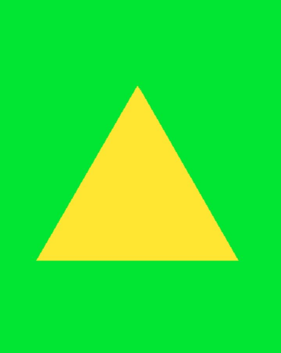

# Shapes

---

## Overview

**Shapes** are classes that all inherit from the `Geometry` interface.
**Shapes** serve as the base for any **copyable** or **drawable** element on the
screen, so learning them is essential.

---

## Usage

To start, we'll use the `Shape` class, contained in the header **"remake2d/shape.hpp"**,
whose class is **templated** on a number of points, and whose constructor takes **two parameters**:

```cpp
template<size_t POINT_COUNT> requires (POINT_COUNT > (u8)point::min && POINT_COUNT <= (u8)point::max)
Shape(const Vec2d& center, const Dim2d& size);
```

- `POINT_COUNT` : number of sides of the shape.
- `center`      : the shape's center.
- `size`        : the shape's size/diameters.

Unlike `Window`, shapes are positioned directly from their center.
The size represents the shape's **vertical** and **horizontal** **diameter**.
Indeed, shapes can be irregular on X and Y.
`POINT_COUNT` itself determines the **number of sides of the shape**.
Let's declare a shape named triangle:

```cpp
rmk::Shape<3> triangle({200, 200}, {50, 50});
```

Numbers limit point are reprenseted by following enumeration:

```cpp
enum class point : u8 {
	min = 0,
	max = 50
};
```

### Drawing a shape

Now we can display our triangle on screen thanks to the `draw` method of the
`Window` class:

```cpp
void draw(const Geometry& shape, Color color = rmk::color::white, std::string_view viewport = "") noexcept;
```

- shape    : shape to draw
- color    : color of the shape's outline
- viewport : targeted viewport (optional, empty = global viewport)

Let's place ourselves in the game loop and write:

```cpp
//In render loop
win.draw(triangle, rmk::color::red);
```

```cpp
#include <remake2d/window.hpp>
#include <remake2d/loop.hpp>
#include <remake2d/shape.hpp>

int main(void) {
    rmk::Window win;
    rmk::Shape<3> triangle({200, 200}, {50, 50});
    
    rmk::loop.execute(win, [&](void) {
        win.draw(triangle, rmk::color::red);
    });
    
    rmk::loop.update();
}
```



It is also possible to **fill** the shape with the `fill` method, similar to `draw`:

```cpp
void fill(const Geometry& shape, Color color = rmk::color::white, std::string_view viewport = "") noexcept;
```

```cpp
win.fill(triangle, rmk::color::red);
```



### Transparency

It is possible to make shapes somewhat transparent. By reducing the *alpha* value of `Color`,
we also reduce **the opacity** of the shape drawn on screen.

example:

without transparency:
```cpp
win.clear(rmk::color::green);
win.fill(triangle, {255, 0, 0, 128}); // semi-transparent red triangle
```



with transparency:
```cpp
win.clear(rmk::color::green);
win.fill(triangle, {255, 0, 0, 128}); // semi-transparent red triangle
```



You can change the transparency mode via the `blendMode` method of the `Window` class, which can take
three distinct values:

```cpp
namespace window {

enum class blendmode : u8 {
	none		= (u8)SDL_BLENDMODE_NONE,
	normal		= (u8)SDL_BLENDMODE_BLEND,
	add			= (u8)SDL_BLENDMODE_ADD
};

}
```

- `none`   : disable transparency on the window
- `normal` : default transparency mode
- `add`    : additive mode with the background color

example:

```cpp
win.blendMode(rmk::window::blendmode::add);
win.clear(rmk::color::green);
win.fill(triangle, {255, 0, 0, 128});
```



---

## Methods

The `Geometry` class has several **pure virtual methods** that `Shape` inherits from.
Among these, we have:

```cpp
virtual u8 points(void)   			 const noexcept = 0; // number of points
virtual Dim2d size(void)   			 const noexcept = 0; // shape size
virtual Vec2d center(void) 			 const noexcept = 0; // center position
virtual const Vec2d* pointsPos(void) const noexcept = 0; // raw points array

virtual void move(const Vec2d& center) noexcept = 0;     // translate shape
virtual void rotate(f32 angle) noexcept = 0;             // rotate shape (radians)
virtual void scale(const Fact2d& scaling) noexcept = 0;  // scale shape
virtual void resize(const Dim2d& size) noexcept = 0;     // resize shape
virtual void transform(const Vec2d& center, f32 angle, const Fact2d& scaling) noexcept = 0; // translate + rotate + scale

template<IsShape S> S  as(void) const noexcept;                    // cast to another shape type
virtual bool           hasIntersected(const Geometry& other) const noexcept = 0; // collision test
```

---

## Shape types

**RE:MAKE 2D** offers several type aliases and specialized types for shapes:

```cpp
// Alias
using Line      = Shape<2>;   // line segment
using Triangle  = Shape<3>;   // triangle
using Losange   = Shape<4>;   // diamond shape
using Hexagone  = Shape<6>;   // hexagon
using Ellipse   = Shape<36>;  // ellipse approximation

// Derived types
class Point     : public Shape<1>;  // single point (dedicated class, not an alias)
class Rectangle : public Shape<4>;  // axis-aligned rectangle (optimized build)
class Square    : public Rectangle; // uniform rectangle
class Circle    : public Ellipse;   // circle (w == h enforced)
```

!!! info
    For the `Square` and `Circle` types, only the `resize` method is overridden to take just the width into account (`transform` is not
	overridden and therefore follows `Geometry`'s standard behavior).
	The constructors of the `Square` and `Circle` types take an `f32` rather than a `Dim2d` in their constructor.

---

[:octicons-arrow-left-24: Previous chapter](loop.md){ .md-button }
[Next chapter :octicons-arrow-right-24:](viewport.md){ .md-button .md-button--primary }