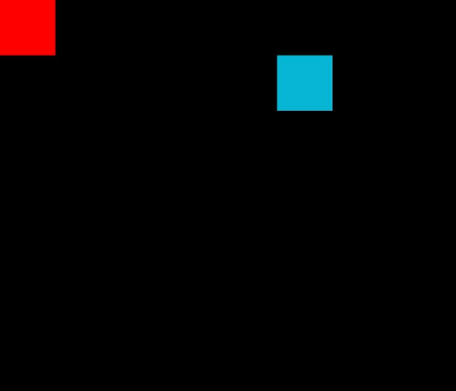

# Viewport

Viewports are extensions of windows that allow restricting rendering to a specific area of the screen.

---

## Overview

Viewports are represented by the `Window::Viewport` structure. They allow delimiting the rendering zone to a defined portion of a window.

By default, every object is rendered within the **global viewport** of the window, whose origin is the top-left corner:

```txt
(0, 0)  _ _ _ _ _ _ _ _ _ _ _ _ _ (x)
       |
       |
       |
       |
       |
       |
       |
      (y)
```

Viewports allow restricting this area to a defined portion:

```txt
(0, 0)  _ _ _ _ _ _ _ _ _ _ _ _ _ (x)
       |
       |
       |     (0, 0) _ _ _ _ (x')
       |           |
       |           |
       |          (y')
       |
      (y)
```

Their constructor is as follows:

```cpp
Viewport(void);
explicit Viewport(const Area& zone);
```

---

## Method

```cpp
Camera& camera(void)             noexcept; // get viewport camera
void area(const Area&)           noexcept; // set viewport area
Area area(void)            const noexcept; // get viewport area
const Camera& camera(void) const noexcept; // get const viewport camera

void clear(Color = rmk::color::black) noexcept;   // clear viewport with solid color
void draw(const Drawable&, i16 layer = 0) noexcept; // draw a drawable object on viewport
void fill(const Fillable&, i16 layer = 0) noexcept; // draw filled a fillable object on viewport
```

The `area` method automatically updates the dimensions and position of the viewport's internal camera, but the `camera` method doesn't.
So be careful when using these methods.

---

## Usage

Viewports are created and managed through the following `Window` methods:

```cpp
void connectViewport(Viewport&)    noexcept;  // register viewport
void disconnectViewport(Viewport&) noexcept;  // unregister viewport
```

For example:

```cpp
#include <remake2d/window.hpp>
#include <remake2d/shape.hpp>
#include <remake2d/loop.hpp>

int main (void) {
    rmk::Window win;
    rmk::Rectangle rect(0, 200); // position (0, 0), size 200x200
    rmk::Window::Viewport vp(rmk::Area(500, 100, 100, 100));

    win.connectViewport(vp); // connect viewport to 'win'

    rmk::loop.execute(win, [&]() {
        rect.color(rmk::color::red);
        win.fill(rect);

        rect.color(rmk::color::cyan);
        vp.fill(rect);
    });

    rmk::loop.update();
}
```



It is mandatory to bind a viewport to a window so that the window knows where to display its rendering;
if this is forgotten, the viewport will simply display nothing.
The viewport's rendering is automatically called by the `present` method of the window to which it is bound.

---

[:octicons-arrow-left-24: Previous chapter](shape.md){ .md-button }
[Next chapter :octicons-arrow-right-24:](../texture/texture.md){ .md-button .md-button--primary }