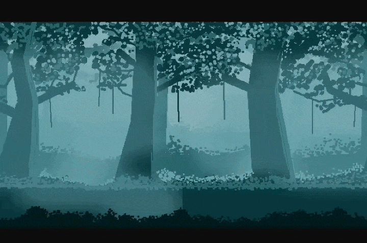

# Parallax

A flat background reads as flat right away; scrolling several layers at different speeds is enough to fake depth,
without modeling anything in 3D.

---

## Overview

`Parallax` is contained in the header **"remake2d/parallax.hpp"**. It's built from a list of `Sprite`s and a list
of speed quotients, one per layer, expressed as a percentage speed reduction relative to the full velocity.

---

## Methods

```cpp
void move(const Vec2d&)     noexcept; // move background
void resize(const Dim2d&)   noexcept; // resize background
void velocity(const Vec2d&) noexcept; // set scroll speed

Dim2d size(void)     const noexcept; // get size
Vec2d center(void)   const noexcept; // get center
Vec2d velocity(void) const noexcept; // get scroll speed
```

---

## Usage

### Creating a parallax

The constructor takes a center, a size, a vector of sprites, and a vector of speed quotients:

```cpp
Parallax(const Vec2d& center, const Dim2d& size, const std::vector<Sprite>& sprites, const std::vector<u8>& quotients_speed);
```

- `sprites`   : the layers to tile, ordered from furthest to closest.
- `quotients` : per-layer speed reduction percentages (0-100): 0 scrolls at the full velocity, 100 keeps the layer fixed.

```cpp
rmk::Sprite sky("sky.png", {{400, 300}, {800, 600}});
rmk::Sprite hills("hills.png", {{400, 300}, {800, 600}});
rmk::Sprite ground("ground.png", {{400, 300}, {800, 600}});

std::vector<rmk::Sprite> sprites   = { sky, hills, ground };
std::vector<rmk::u8>     quotients = { 80, 40, 0 };

rmk::Parallax bg({400, 300}, {800, 600}, sprites, quotients);
```

!!! info
    If more quotients than sprites are provided, they're resampled evenly across the available layers.


### Scrolling

Velocity sets a constant scroll speed applied every frame, scaled by each layer's speed factor:

```cpp
bg.velocity({-150, 0});
```

Each layer tiles itself automatically once it scrolls off-screen, giving an endless scrolling effect 
without ever having to reposition anything manually.

### Drawing a parallax

```cpp
#include <remake2d/all/bases.hpp>
#include <remake2d/parallax.hpp>
#include <remake2d/loop.hpp>

int main (void) {
    rmk::Window win;

    rmk::Rectangle rect(win.center(), win.size());

    std::vector<rmk::Sprite> sprites = {
        rmk::Sprite("Layers/1.png", rect),
        rmk::Sprite("Layers/2.png", rect),
        rmk::Sprite("Layers/3.png", rect),
        rmk::Sprite("Layers/4.png", rect),
        rmk::Sprite("Layers/5.png", rect),
        rmk::Sprite("Layers/6.png", rect)
    };
    std::vector<rmk::u8> quotients = { 100, 75, 50, 25, 10, 0 };

    rmk::Parallax bg(win.center(), win.size(), sprites, quotients);

    bg.velocity({-150, 0});

    rmk::loop.execute(win, [&](void) {
        win.fill(bg);
    });

    rmk::loop.update();
}
```



!!! info
    The sprites used above come from the website [itch.io](https://saurabhkgp.itch.io/pixel-art-forest-background-simple-seamless-parallax-ready-for-2d-platformer-s?download).

---

## Property

| Type | Copiable | Movable | Bases and Traits |
|---|---|---|---|
| Parallax | Yes | Yes | Printable |

---

[:octicons-arrow-left-24: Previous chapter](tilemap.md){ .md-button }
[Next chapter :octicons-arrow-right-24:](../scene/actor.md){ .md-button .md-button--primary }