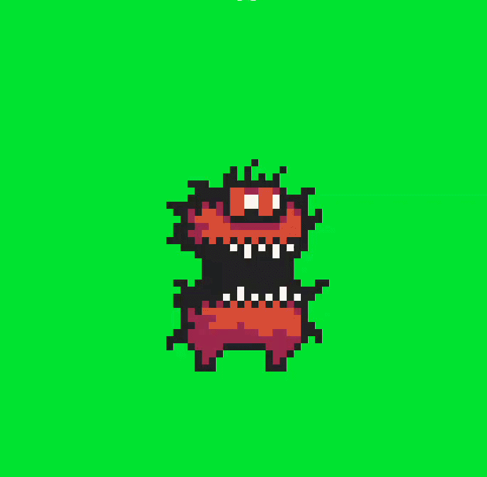

# Animation

A single static sprite rarely sells movement; cycling through the frames of a sprite sheet at a steady rate is what actually makes a 
character look like it's walking or attacking.

---

## Overview

`Animation` is contained in the header **"remake2d/texture.hpp"**, inheriting from `Sprite`. It cycles automatically through evenly spaced
frames of a sprite sheet, clipping the underlying texture to the current frame on every call to play.

---

## Methods

```cpp
void play(i8 loop = 0, u8 fps = 12); // start the animation
void pause(void)  noexcept;          // pause on the current frame
void resume(void) noexcept;          // resume after pause
void stop(void)   noexcept;          // stop and reset to the first frame
```

---

## Usage

### Creating an animation

```cpp
Animation(std::string_view path, const Rectangle& shape,
          u8 total_clips, Dim2d clip_size,
          Vec2d start_pos = {0, 0}, u8 spacing = 0);
```

- `total_clips` : number of frames in the sheet.
- `clip_size`   : size of a single frame.
- `start_pos`   : top-left position of the first frame in the sheet.
- `spacing`     : gap between frames, if any.

```cpp
rmk::Animation walk("player_walk.png", {{400, 300}, {32, 48}}, 6, {32, 48});
```

### Playing an animation

Play must be called every frame for the animation to advance; it takes a loop count and a playback speed in frames per second:

```cpp
// In render loop
walk.play(-1, 8); // loop forever, 8 frames per second
```

- `loop` : `0` plays once, a positive number repeats that many times, `-1` loops forever.

### Drawing an animation

Since `Animation` inherits from `Sprite`, it draws exactly the same way:

```cpp
win.draw(walk, rmk::color::white);
```

### Pausing and stopping

Pause freezes on the current frame without resetting, while stop resets back to the first frame entirely:

```cpp
walk.pause();
walk.resume();
walk.stop();
```

!!! info
    Calling `play` again after `stop` restarts the animation from its first frame, exactly as if it had never played before.

### Example

To more easily illustrate their use, we will use this simple code example and a free animation from Pixel Studio.
You can download the animation sheet [here](assets/texture3.png) .¬

```cpp
#include <remake2d/all/everything.hpp>

int main () {
	rmk::Window win;

	rmk::Animation anim(
	        "texture3.png",					// path to animation sheet
	        {win.center(), {320, 360}},     // Printing rectangle
	        4,								// 4 clips
	        {32, 36},						// clip size
	        {0, 0}							// clip position
	)
	
	anim.play(-1, 8);						// infinity loop + 8 fps speed
	
	rmk::loop.execute(win, [&] (){
		win.clear(rmk::color::green);		// clear screen on green
		win.draw(anim);						// draw current clip
	});
	
	rmk::loop.update();		// launch app
}

```

result:



---

[:octicons-arrow-left-24: Previous chapter](text.md){ .md-button }
[Next chapter :octicons-arrow-right-24:](../sound/sound.md){ .md-button .md-button--primary }