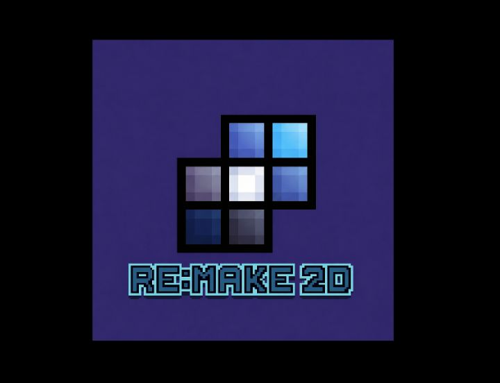
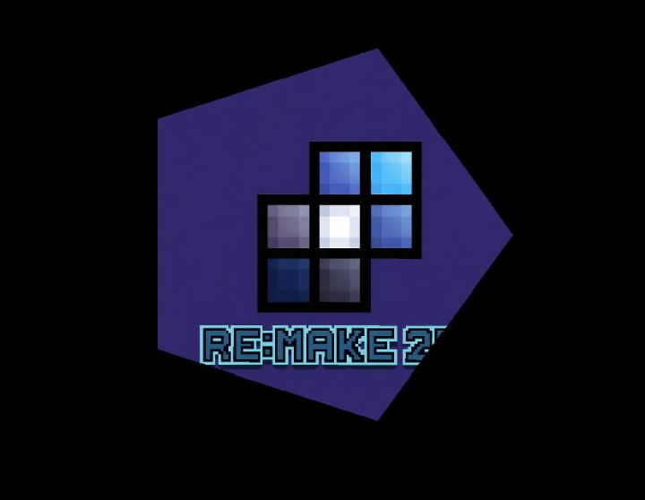

# Texture

Drawing a shape's outline only goes so far; sooner or later a game needs actual images on screen, whether it's a sprite, a background, or a UI element.

---

## Overview

Textures are represented by `Texture<S>`, contained in the header **"remake2d/texture.hpp"**. It loads an image from disk and maps it onto a `Geometry`,
following the exact contour of that shape rather than a plain rectangle. `TextureBase` is the abstract interface shared by every texture type, including
`Text` and `Animation`.

```cpp
template<IsShape S> class Texture;
```

`S` can be any type satisfying `IsShape` — `Rectangle`, `Circle`, etc .
The image is triangulated and mapped onto that shape's actual points.

!!! info
	`Texture` is **copiable** and **movable** .
    `Sprite` is simply an alias for the most common case, `Texture<Rectangle>`. It is **not** a separate texture system — it behaves exactly like any
    other `Texture<S>`, just permanently locked to a rectangular shape .

---

## Methods

```cpp
void move(const Vec2d&)     noexcept; // translate the texture
void rotate(f32)            noexcept; // rotate the texture (radians)
void scale(const Fact2d&)   noexcept; // scale the texture
void resize(const Dim2d&)   noexcept; // resize the texture
void transform(const Vec2d&, f32, const Fact2d&) noexcept; // move + rotate + scale

void clip(const Vec2d&, const Dim2d&) noexcept; // restrict drawing to a sub-region of the image
void unclip(void)                     noexcept; // remove that restriction

Vec2d center(void)   const noexcept; // get center position
Dim2d size(void)     const noexcept; // get current size
Dim2d realSize(void) const noexcept; // get original image size

bool hasIntersected(const Geometry&)    const noexcept; // collision test
bool hasIntersected(const TextureBase&) const noexcept; // collision test
```

---

## Usage

### Loading a sprite

The most common texture is a `Sprite`, a `Texture<Rectangle>` alias, taking a path and a `Rectangle` describing its position and size:

```cpp
Sprite(std::string_view path, const Rectangle&);
```

```cpp
rmk::Sprite player("player.png", {{400, 300}, {64, 64}});
```

### Loading a shaped texture

Any other shape works the same way, just constructed directly through `Texture<S>` instead of the `Sprite` alias:

```cpp
Texture(std::string_view path, const S& shape);
```

```cpp
rmk::Shape<5> pentagon({400, 300}, {150, 150});
rmk::Texture<rmk::Shape<5>> gem("gem.png", pentagon);
```

### Drawing a texture

Drawing works identically regardless of `S` — `Window::draw` doesn't need to know or care what shape underlies the texture, since it always
renders the triangulated, UV-mapped vertices produced by that shape:

```cpp
// In render loop
win.draw(player);
win.draw(gem);
```

```cpp
#include <remake2d/window.hpp>
#include <remake2d/loop.hpp>
#include <remake2d/texture.hpp>

int main(void) {
    rmk::Window win;
    rmk::Sprite player("player.png", {win.center(), {64, 64}});

    rmk::loop.execute(win, [&](void) {
        win.draw(player);
    });

    rmk::loop.update();
}
```

### Tinting and transparency

A texture has no color of its own; tint and opacity are entirely driven by the `Color` passed to draw, since the underlying image is generated 
white so color modulation applies correctly:

```cpp
win.draw(player, rmk::color::red);           // tinted red
win.draw(player, {255, 255, 255, 128});      // half transparent
```

This applies the same way whether the texture is a `Sprite` or any other shaped `Texture<S>`.

### Clipping a sprite sheet

Clip restricts drawing to a sub-rectangle of the source image, useful for picking a single frame out of a larger sheet without loading separate files:

```cpp
player.clip({64, 0}, {64, 64}); // second frame of a 64x64 sheet
```

`unclip` removes that restriction, going back to drawing the full image. Clipping works on any `Texture<S>`, not just rectangular sprites: the
clipped sub-region of the image is re-mapped across whatever shape `S` is, following that shape's contour exactly as an unclipped texture would.

### Moving and transforming

Move, rotate, scale and resize all behave the same way as on a `Geometry`, and keep the texture's underlying shape and vertices in sync automatically:

```cpp
player.move({450, 300});
player.rotate(0.2f);
player.resize({96, 96});
```

### Collision

hasIntersected checks overlap against a `Geometry` or another `TextureBase`, reusing the same separating-axis test as shapes. As noted above,
this test follows the texture's actual shape — a `Sprite`'s rectangle, or a `Texture<S>`'s real contour for any other shape:

```cpp
if (player.hasIntersected(wallSprite)) { /* blocked */ }
if (gem.hasIntersected(playerHitbox))  { /* precise pentagon-shaped pickup */ }
```

---

## Sprite vs Image

This is the part that trips people up: a `Sprite` and a `Image<Pentagon>` (or any other shape) are the **same class template**, `Image<S>`, just
instantiated with a different `S`. The difference isn't in how the image is loaded or drawn — it's entirely in **which points the image gets mapped onto**.

!!! info
	`Image<S>` is a simple alias of `Texture<S>` .
	
### Sprite — a rectangle, always

```cpp
class Sprite : public Image<Rectangle> {
public:
    Sprite(std::string_view, const Rectangle&);
};
```

`Sprite` locks `S` to `Rectangle`. Whatever image you load, it gets stretched across exactly 4 points forming an axis-aligned box — the image's
own content might have transparent corners or an irregular silhouette, but the texture's *shape* (used for triangulation, collision, and rendering
bounds) is always a plain rectangle.

```cpp
rmk::Rectangle rectangle(win.center(), 500);
rmk::Sprite banner("banner.png", rectangle);

// In game loop
win.draw(banner);
```



Even if `banner.png` visually contains a diamond or a rounded icon, the underlying geometry driving rendering, rotation, and collision is a
rectangle. This is what you want majority of the time — UI panels, tile textures, standard character sprites — since most source images are
naturally rectangular anyway.

### Image — any shape, pixel-mapped onto its actual contour

Pass any other shape as `S` and the exact same image gets triangulated and UV-mapped onto *that* shape's points instead. A `Image<Shape<5>>`
(a pentagon) doesn't just clip a rectangular image into a pentagon-ish crop — it fits the image across the five actual vertices of the polygon,
following its real contour for rendering **and** for collision detection.

```cpp
rmk::Shape<5> pentagon(win.center(), 500);
rmk::Texture gem("gem.png", pentagon);

// In game loop
win.draw(gem);
```



Here, `hasIntersected` on `gem` tests against the pentagon's five edges, not a rectangular bounding box — so a click near a corner that falls
outside the pentagon but inside its bounding rectangle correctly registers as a miss. With a `Sprite`, that same click would register as a hit,
since its underlying shape has no corners to speak of beyond the rectangle itself.

The same applies to any other shape alias:

```cpp
rmk::Image<rmk::Circle>    coin("coin.png", rmk::Circle({400, 300}, 64));
rmk::Image<rmk::Hexagone>  tile("hex_tile.png", rmk::Hexagone({400, 300}, {96, 96}));
rmk::Image<rmk::Triangle>  flag("flag.png", rmk::Triangle({400, 300}, {80, 80}));
```

!!! warning
    Choosing a non-rectangular `S` only changes the geometry the image is mapped onto and tested against — it does **not** crop or mask the
    source image file itself. If `gem.png` is a square PNG with a pentagon drawn inside it and transparent corners, using `Image<Shape<5>>`
    additionally aligns the *collision and render triangulation* with the pentagon, rather than the surrounding transparent square that a
    `Sprite` would have used.

---

[:octicons-arrow-left-24: Previous chapter](../graphics/viewport.md){ .md-button }
[Next chapter :octicons-arrow-right-24:](text.md){ .md-button .md-button--primary }